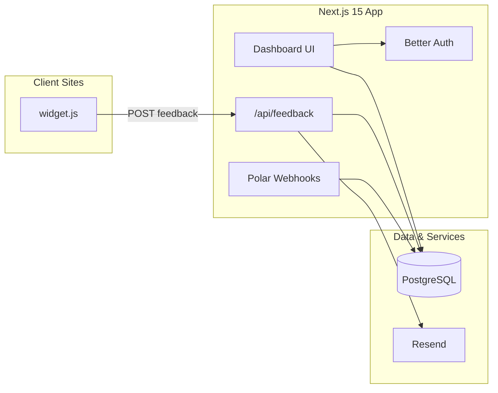

# FeedbackDeck

Full-stack feedback collection platform — embed a lightweight widget on any site, manage submissions in a React dashboard, and track analytics over time.

[](https://feedbackstar.vercel.app)
[](https://nextjs.org)
[](https://www.typescriptlang.org)
[](https://orm.drizzle.team)

**Live app:** [feedbackstar.vercel.app](https://feedbackstar.vercel.app)

---

## Overview

FeedbackDeck is a production-ready SaaS for collecting in-product feedback. Site owners embed a single script tag; visitors submit bug reports, feature requests, praise, or general comments with optional star ratings. Owners review everything in a multi-project dashboard with category filters, response workflows, and analytics charts.

Built as a full-stack TypeScript application with multi-tenant organizations, subscription billing, and email notifications.

## Features

| Area | What you get |
|------|----------------|
| **Widget** | Vanilla JS embed (~880 LOC), no framework dependency, CORS-safe public API |
| **Dashboard** | Projects, feedback inbox, status workflow (unread → responded → archived) |
| **Analytics** | Category breakdown, weekly trends, response rate, Recharts visualizations |
| **Auth** | Better Auth — Google OAuth + email/password, session management |
| **Billing** | Polar.sh checkout, customer portal, webhook-driven subscription state |
| **Email** | Resend + React Email templates for new feedback and owner responses |
| **Admin** | System role management, org-level member roles |

## Architecture



## Tech stack

- **Framework** — Next.js 15 (App Router), React 19, Turbopack dev
- **Language** — TypeScript, Zod validation
- **Database** — PostgreSQL + Drizzle ORM (11 migrations)
- **Auth** — Better Auth
- **Payments** — Polar.sh
- **Email** — Resend, React Email
- **UI** — shadcn/ui, Tailwind CSS v4, Radix UI, Recharts
- **Deploy** — Vercel

## Project structure

```
feedbackdeck/
├── app/                    # Next.js routes (dashboard, API, auth, pricing)
├── components/             # React UI (forms, charts, shadcn components)
├── db/                     # Drizzle schema + connection
├── lib/                    # Auth, email, Polar helpers
├── migrations/             # SQL migrations
├── public/widget/widget.js # Embeddable feedback widget
└── scripts/seed-admin.ts   # CLI to promote admin users
```

## Getting started

### Prerequisites

- Node.js 20+
- pnpm
- PostgreSQL database (local or hosted)

### Setup

```bash
git clone https://github.com/0xrameshh/feedbackdeck.git
cd feedbackdeck
pnpm install
cp .env.example .env.local
# Fill in DATABASE_URL and auth secrets in .env.local
pnpm db:migrate
pnpm dev
```

Open [http://localhost:3000](http://localhost:3000).

### Environment variables

Copy `.env.example` to `.env.local` and configure:

| Variable | Required | Description |
|----------|----------|-------------|
| `DATABASE_URL` | Yes | PostgreSQL connection string |
| `BETTER_AUTH_SECRET` | Yes | Random secret for session signing |
| `BETTER_AUTH_URL` | Yes | App URL (`http://localhost:3000` locally) |
| `NEXT_PUBLIC_APP_URL` | Yes | Public app URL (same as above in dev) |
| `GOOGLE_CLIENT_ID` | For OAuth | Google OAuth client ID |
| `GOOGLE_CLIENT_SECRET` | For OAuth | Google OAuth client secret |
| `RESEND_API_KEY` | For email | Resend API key |
| `POLAR_ACCESS_TOKEN` | For billing | Polar.sh access token |
| `POLAR_WEBHOOK_SECRET` | For billing | Polar webhook signing secret |

## Widget embed

1. Sign in and create a project in the dashboard.
2. Copy your project ID from project settings.
3. Add before `</body>`:

```html
<script
  src="https://feedbackstar.vercel.app/widget/widget.js"
  data-project-id="YOUR_PROJECT_ID"
  defer
></script>
```

The widget auto-detects the API host from the script URL, so it works on localhost during development when served from your Next.js app.

### Widget API

Public endpoint (no auth):

```
POST /api/feedback
Content-Type: application/json

{
  "projectId": "uuid",
  "message": "The checkout button is broken on mobile",
  "category": "bug",
  "rating": 2,
  "pageUrl": "https://example.com/pricing",
  "userEmail": "user@example.com"
}
```

Categories: `general`, `bug`, `feature`, `praise`.

## Scripts

```bash
pnpm dev          # Dev server (Turbopack)
pnpm build        # Production build
pnpm start        # Run production server
pnpm lint         # ESLint
pnpm db:migrate   # Apply Drizzle migrations
pnpm seed-admin user@example.com   # Promote user to admin
```

## Deployment

Deploy to Vercel (or any Node host):

1. Connect the GitHub repo.
2. Set environment variables from `.env.example`.
3. Run migrations against your production database.
4. Configure Polar webhook URL: `https://your-domain/api/polar/webhooks`.

## License

MIT — see [LICENSE](LICENSE).

## Author

**Ramesh Kumar** — [github.com/0xrameshh](https://github.com/0xrameshh) · [0xrameshh.github.io](https://0xrameshh.github.io)
